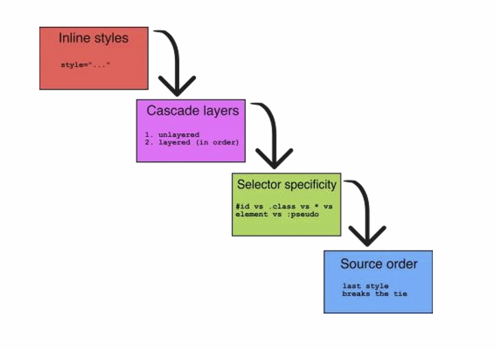
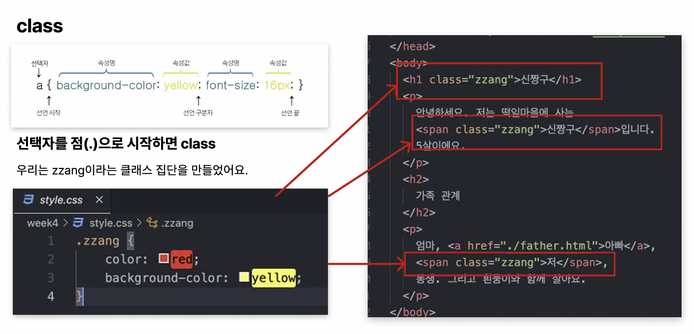
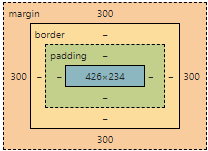
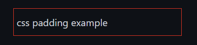
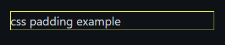
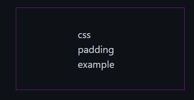
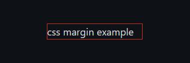
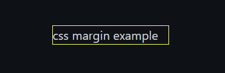
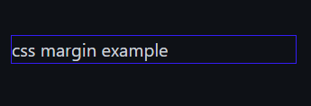
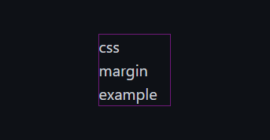

# CSS
### Cascading Style Sheets
HTML에 스타일을 표현하게 해주는 언어
- cascading :  여러 스타일 규칙이 적용될 때, 우선순위에 따라 스타일이 결정<br>(외부 스타일 < 내부 스타일 < 인라인 스타일)

- style sheet :  CSS의 스타일 규칙들을 모아둔 파일이나 블록

#### 스타일 종류
1. **인라인(inline)** 스타일<br>태그에 직접적으로 스타일을 입히는 방식
```html
<h1 style="color: yellow; background-color: red;">신짱구</h1>
```
- `color, background-color` 속성명
- `yellow, red` 속성값
- `;` 선언 구분자/끝

2. **내부(internal)** 스타일<br>head 태그 내부에 style 태그로 정의
```css
h1, h2, h3, h4, h5, h6 { color : yellow; background-color : red;}
```
- `h1~h6` 스타일을 적용하려는 부분

3. **외부(external)** 스타일
- HTML 문서와는 별개의 파일에서 스타일을 지정
- style.css 파일 생성 > 스타일링 코드(위와 동일) 작성 > *link 태그*로 연결
```html
<link rel="stylesheet" href="./style.css">
```
- _**class**_<br>원하는 태그만 분류 후 스타일 동시 적용<br>같은 이름을 가진 태그들마다 CSS로 효과를 부여할 수 있음

`<span>` 단순 텍스트나 텍스트에 관련된 마크업 등 구문 콘텐츠에 스타일이나 자바스크립트를 적용하기 위한 범위를 감싸주거나, HTML 속성을 적용하기 위한 범위를 감싸주기 위해 사용
---
# Padding과 Margin

<br>내용(content)-패딩(padding)-테두리(border)-마진(margin)

### Padding
#### 내용과 테두리 사이의 '여유공간'
1. top, bottom, left, right를 각각 적어주기
```css
<p> css padding example </p>
<style>
    p{
        border:1px solid red;
        padding-top:10px;
        padding-bottom:10px;
        padding-left:5px;
        padding-right:5px;
    }
</style>
```


2. 한 줄에 다 쓰기
- 패딩 크기가 다 다른 경우
```css
<p> css padding example </p>
<style>
    p{
        border:1px solid yellow;
        padding:10px(위) 5px(오른쪽) 10px(아래) 5px(왼쪽);
    }
</style>
```


- 패딩 크기가 다 같은 경우
```css
<p> css padding example </p>
<style>
    p{
        border:1px solid blue;
        padding:30px;
    }
</style>
```


- 위=아래, 왼쪽=오른쪽인 경우
```css
<p> css padding example </p>
<style>
    p{
        border:1px solid purple;
        padding:30px 100px;
    }
</style>
```


### Margin
#### 요소 주위의 여백, 다른 요소와의 사이 공간
1. top, bottom, left, right를 각각 적어주기
```css
<p> css margin example </p>
<style>
    p{
        border:1px solid red;
        margin-top:50px;
        margin-bottom:50px;
        margin-left:60px;
        margin-right:60px;
    }
</style>
```


2. 한 줄에 다 쓰기
- 크기가 다 다른 경우
```css
<p> css margin example </p>
<style>
    p{
        border:1px solid yellow;
        margin:50px(위) 60px(오른쪽) 50px(아래) 60px(왼쪽);
    }
</style>
```


- 크기가 다 같은 경우
```css
<p> css margin example </p>
<style>
    p{
        border:1px solid blue;
        margin:50px;
    }
</style>
```


- 위=아래, 왼쪽=오른쪽인 경우
```css
<p> css margin example </p>
<style>
    p{
        border:1px solid purple;
        margin:30px 100px;
    }
</style>
```


3. 가운데 정렬
```css
<p> css margin example </p>
<style>
    p{
        border:1px solid white;
        margin-top:50px;
        margin-bottom:50px;
        margin-left:auto;
        margin-right:auto;
    }
</style>
```


---
참고
[마크다운문법](https://inpa.tistory.com/entry/MarkDown-%F0%9F%93%9A-%EB%A7%88%ED%81%AC%EB%8B%A4%EC%9A%B4-%EB%AC%B8%EB%B2%95-%F0%9F%92%AF-%EC%A0%95%EB%A6%AC)
[padding/margin](https://marketinkerbell.com/entry/CSS-margin-padding-%EC%B0%A8%EC%9D%B4%EC%A0%90-%EC%82%AC%EC%9A%A9%EB%B2%95)