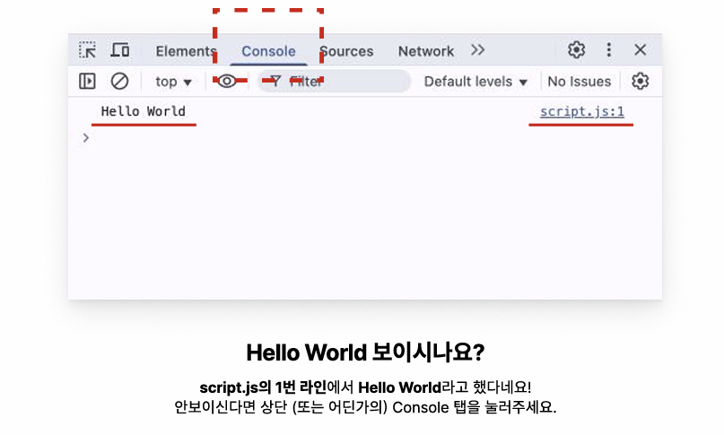
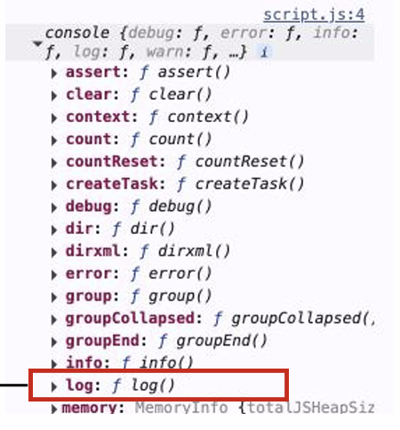
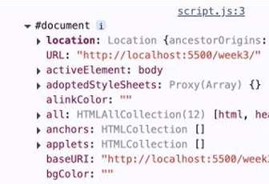
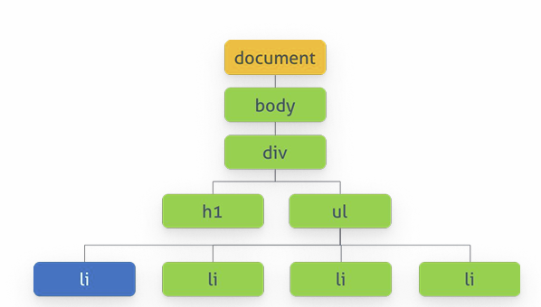

# JavaScript
### 웹문서를 동적으로 만들기 위해(내가 작성한 스크립트대로 페이지를 조작하자!) 만들어진 언어

#### html과 js 연결하기
```html
 <script src="script.js"></script>
 ```
**html body 태그 _마지막_ 에 넣기**<br>
브라우저 : HTML 문서를 한 줄 한 줄 순차적으로 읽음(파싱)<br><br>
`파싱 중 script 발견한다면?`<br>
1. 파싱 중단
2. script 파일(js) 다운로드
3. script 파일 실행
4. HTML 이어서 파싱<br>

-> script 태그 위치가 마지막에 있지 않을 경우
1. 화면이 늦게 뜸
2. 순서가 꼬일 수 있음 : 원하는 태그의 내용을 바꾸라는 js 명령어가 실행됐지만 파싱한 HTML 내용에 그 태그가 없을 수 있음

#### 자바스크립트에서의 데이터 타입 : _문자열_ 
1. 변수 선언
```javascript
let hello = "Hello World";
```
`문자열 선언 방법` "" , '', ``<br>

2. 출력
```javascript
console.log(hello);
```


#### 자바스크립트에서의 데이터 타입 : _객체_ 
1. 객체 선언
```javascript
let hongik={};
```
2. 객체 내부에서 속성, 값 정의
```javascript
let hongik = {
 name: "Hongik University",
 };
```
3. 객체 외부에서 속성, 값 정의
```javascript
let hongik = {};
hongik.name = "Hongik University";
```
4. 특정 속성만 출력
```javascript
console.log(hongik.name);
```
<br>

> console 객체

브라우저의 콘솔에 접근을 할 수 있도록 해주는 객체


> 문서객체모델(DOM, Document Object Model)

- 브라우저 내에서 컨텐츠를 보여주는 웹 페이지 자체를 대변하는 객체<br>
=script 태그로 연결한 HTML 문서

- HTML 태그 하나하나를 자바스크립트로 컨트롤 할 수 있도록 만든 객체 체계(트리구조)


#### JS로 HTML의 section 태그에 내용 추가하기
1. section 태그 찾기
```javascript
let sectionTag = document.querySelector("section");
```
2. section에 들어갈 태그 만들고 텍스트 추가하기
```javascript
let h2Tag = document.createElement("h2");
h2Tag.innerText = “2025 홍익대학교 축제”;
```
3. 위 태그를 body 태그에 추가하기
```javascript
sectionTag.appendChild(h2Tag);
```
`업데이트할 기존 태그 찾기`
=> `새로운 태그 만들기` => `새로운 태그에 데이터 넣기` => `새로운 태그를 기존 태그에 추가하기`

#### 자바스크립트에서의 데이터 타입 : _배열_
1.  배열 선언
```javascript
let array = [];
```
2. 선언과 동시에 요소 추가
```javascript
let array = [1, 2, 3];
```
3. 선언 후 요소 추가
```javascript
let array = [];
array.push(1);
array.push(2);
array.push(3);
//push() 메서드 사용용
```
`배열 요소 추가 및 제거 방식`<br>
(1) unshift() 메서드
```javascript
let array = [1, 2, 3];
array.unshift(0); // [0, 1, 2, 3]
```
(2) length 프로퍼티 이용
```javascript
let array = [1, 2, 3];
array[array.length] = 4; // [1, 2, 3, 4]
```
(3) splice() 메서드
```javascript
배열이름.splice(인덱스, 제거할 요소 개수, 추가할 요소 개수);
```
(4) shift() 메서드
```javascript
let array = [1, 2, 3];
array.shift(); // [2, 3]
```
(5) pop() 메서드
```javascript
let array = [1, 2, 3];
array.pop(); // [1, 2]
```
(6) delete 연산자
```javascript
let array = [1, 2, 3];
delete array[0]; // 1은 삭제되고 undefined로 변경됨, 배열의 길이 변화X
```
<br>

4. 배열 요소 접근
```javascript
let array = [1, 2, 3];
console.log(array[0]); // 1
console.log(array.length-1); // 3, 배열명.length;로 배열 요소 개수 확인
```