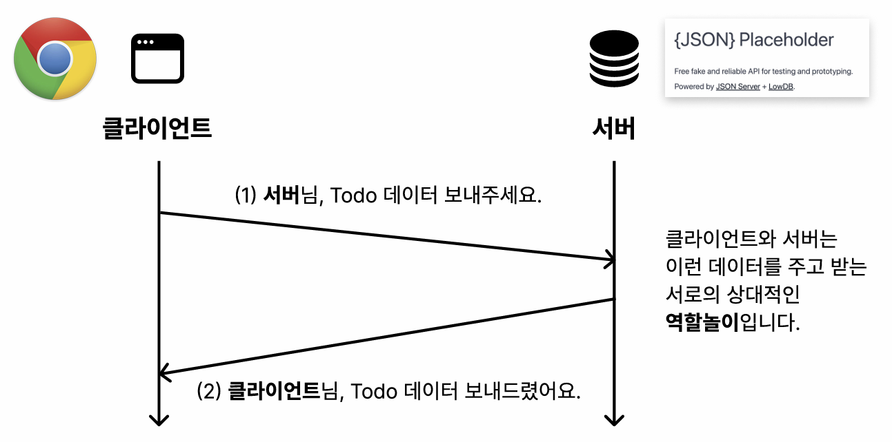

## 용어 정리
### 서버 server
다양한 기능, 데이터, 서비스를 제공하는 컴퓨터나 소프트웨어 전반 <br>
= 고객이 요청하면 뭔가를 서빙하는 일을 함
### 클라이언트 client
= 서빙을 받는 고객

*서버끼리도 가능
### API
Application Programming Interface <br>
클라이언트와 서버 간의 데이터를 주고 받는 **통로 역할** <br>
서로 다른 소프트웨어인 두 역할간 상호작용을 돕는 *인터페이스*
### 프론트엔드 frontend
사용자가 직접 상호작용하는 웹 페이지의 화면을 다루는 개발 영역
### 백엔드 Backend
서버에서 동작하는 부분을 다루는 개발 영역 <br>
비지니스 로직 처리, 인증, 보안 등을 다룸

---

# fetch 함수
```javascript
fetch('https://jsonplaceholder.typicode.com/users1/1/todos')
```
네트워크 요청을 서버 데이터를 받아오는 표준 API 함수 <br>

# ID
나만을 식별할 수 있는 고유한 무언가 <br>
=> 하나의 id는 하나의 태그를 의미

class|id
:---:|:---:
분반|학번
.으로 시작|#으로 시작

---

## 버튼 핸들링
```javascript
button.addEventListener("click", function()){
    console.log("Button clicked");
};
```
`addEventLister` button에 무언가 중요한 사건(이벤트)이 발생하면 실행<br>
=click 이라는 이벤트가 발생하면 function()을 실행하라

---

# SEO
Search Engine Optimization<br>
검색 엔진 최적화
구글 검색시 우리 웹 페이지가 최상단에 나오도록 최적화하는 전략

#### 웹 접근성
인적, 환경적 요인에 제약이 없는 웹 정보 접근 <br>
모두가 사용할 수 있는 WEB을 지향 <br>
`엔진의 알고리즘 대부분이 웹 접근성, 웹 호환, 웹 표준에 있다!`

### 스크린 리더
HTML을 위에서부터 아래로 읽음 <br>
방향키와 Tab키로 다음 태그로 넘어갈 수 있음